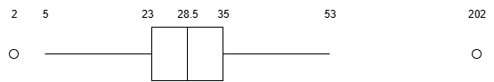

# BACS3013 JAN 2025 Answers

[Link to the paper](https://eprints.tarc.edu.my/31781/1/BACS3013.pdf)

- [Question 1](#question-1)
- [Question 2](#question-2)
- [Question 3](#question-3)
- [Question 4](#question-4)

## Answers

### Question 1

a)

i)

| Age | Height (m) | Running speed (miles per hour) | Distance   |
| --- | ---------- | ------------------------------ | ---------- |
| 25  | 1.62       | 6.5                            | 4.18       |
| 32  | 1.75       | 7.0                            | **_3.05_** |
| 30  | 1.79       | 8.5                            | **_1.01_** |
| 28  | 1.55       | 5.5                            | **_1.25_** |
| 36  | 1.52       | 6.0                            | 7.28       |
| 23  | 1.68       | 10.0                           | 6.12       |

$\frac{7.0 + 8.5 + 5.5}{3} = \frac{21}{3} = 7.0$

ii) Possible reason for the inconsistency is **overfitting**. KNN models are particularly susceptible to overfitting **if the value of K is too small**, as they may capture noise in the training data. If **training data is not representative** of the real-world data, the model may struggle to make accurate predictions for unseen data points.

b)

i) **Descriptive analytics**. This type of analysis is used in above scenario to summarize and interpret historical data to identify patterns and trends. For example, association rule mining can be used to identify items that are frequently purchased together, which can help to extract purchase patterns from previous supermarket transactions.

ii) **Predictive analytics**. This type of analysis is used in above scenario to make predictions on future weather conditions based on historical weather data. For example, regression analysis can be used to predict future temperature and rainfall based on past weather patterns.

c)

1. **Data Entry Error**: The water usage data for household DI-2109 may have been accidentally omitted or incorrectly recorded during data entry, leading to missing information in the dataset.
2. **Meter Malfunction**: The water meter for household DI-2109 may have malfunctioned or been faulty during the data collection period, resulting in no recorded water usage data for that household.

### Question 2

a) Python, R, SAS, Apache Spark, MATLAB

Python is the most suitable tool for data analysis because it has a wide range of libraries and frameworks specifically designed for data analysis, such as Pandas, NumPy, and Matplotlib, which make it easy to manipulate, analyze, and visualize data.

b) -

c) Roles in a data analytics team

| Role                  | Description                                                                                                                                                                                                                                                                                              |
| --------------------- | -------------------------------------------------------------------------------------------------------------------------------------------------------------------------------------------------------------------------------------------------------------------------------------------------------- |
| Data Scientist        | Responsible for collecting, analyzing, and interpreting large datasets to extract valuable insights and inform business decisions. For example, a data scientist may analyze historical patient data to identify patterns and trends that can model disease progression and inform treatment strategies. |
| Database Admin        | Responsible for providing access to data, together with database schema design for data scientists to perform their analysis. For example, a database admin needs to feed the data scientist with the relevant patient data from the hospital database.                                                  |
| Doctor                | Responsible for providing domain knowledge and expertise to ensure that the data analysis is relevant and accurate. For example, a doctor can help to interpret the results of the data analysis and provide insights into how the findings can be applied to provide personalized treatment plans.      |
| Legal Expert          | Responsible for ensuring that the data analysis complies with relevant laws and regulations, such as data privacy and security laws. For example, a legal expert can help to ensure that patient data is handled in accordance with PDPA regulations.                                                    |
| Software Tools Vendor | Responsible for providing the necessary software tools and infrastructure to support data analysis. For example, a software tools vendor can provide the data analytics team with access to cloud-based computing resources to handle large datasets and perform complex analyses.                       |

### Question 3

a)

| Median                     | Q1  | Q3  |
| -------------------------- | --- | --- |
| $\frac{28 + 29}{2} = 28.5$ | 23  | 35  |

b)

- $\text{IQR} = \text{Q3} - \text{Q1} = 35 - 23 = 12$

- $\text{MIN} = \text{Q1} - 1.5 \times \text{IQR} = 23 - 1.5 \times 12 = 23 - 18 = 5$

- $\text{MAX} = \text{Q3} + 1.5 \times \text{IQR} = 35 + 1.5 \times 12 = 35 + 18 = 53$

- Item 2 with value 2 and Item 7 with value 202 are outliers.

c)

d)

$\text{Mean} = \frac{33 + 2 + 35 + 23 + 22 + 28 + 202 + 29 + 38 + 25}{10} = \frac{437}{10} = 43.7$

$\text{STD} = \sqrt{\frac{(33-43.7)^2 + (2-43.7)^2 + (35-43.7)^2 + (23-43.7)^2 + (22-43.7)^2 + (28-43.7)^2 + (202-43.7)^2 + (29-43.7)^2 + (38-43.7)^2 + (25-43.7)^2}{10-1}} = \sqrt{3192.46} \approx 56.5$

| Age | Z-Score                                     |
| --- | ------------------------------------------- |
| 33  | $\|\frac{33 - 43.7}{56.5} \| \approx 0.19$  |
| 2   | $\|\frac{2 - 43.7}{56.5} \| \approx 0.73$   |
| 35  | $\|\frac{35 - 43.7}{56.5} \| \approx 0.15$  |
| 23  | $\|\frac{23 - 43.7}{56.5} \| \approx 0.37$  |
| 22  | $\|\frac{22 - 43.7}{56.5} \| \approx 0.38$  |
| 28  | $\|\frac{28 - 43.7}{56.5} \| \approx 0.28$  |
| 202 | $\|\frac{202 - 43.7}{56.5} \| \approx 2.80$ |
| 29  | $\|\frac{29 - 43.7}{56.5} \| \approx 0.26$  |
| 38  | $\|\frac{38 - 43.7}{56.5} \| \approx 0.10$  |
| 25  | $\|\frac{25 - 43.7}{56.5} \| \approx 0.33$  |

No outliers detected using Z-score method with threshold of 3.

### Question 4

a)

i) Association Rules is a data mining technique used to discover interesting relationships or patterns between different items in a dataset. It discovers rules that describe how the presence of one item in a transaction is related to the presence of another item.

ii) 2

iii)

$Support(pencil) = \frac{4}{8} = 0.5$

$Support(eraser) = \frac{6}{8} = 0.75$

$Support(pencil, eraser) = \frac{3}{8} = 0.375$

$Confidence(pencil \rightarrow eraser) = \frac{Support(pencil, eraser)}{Support(pencil)} = \frac{0.375}{0.5} = 0.75$

$Lift(pencil \rightarrow eraser) = \frac{Support(pencil, eraser)}{Support(pencil) \times Support(eraser)} = \frac{0.375}{0.5 \times 0.75} = 1.0$

iv) According to the lift value of 1.0, it indicates that there is no association between purchasing a pencil and an eraser. In other words, the likelihood of purchasing an eraser is not influenced by whether or not a pencil is purchased.

b)

$F1 = 2 \times \frac{0.92 \times 0.87}{0.92 + 0.87} = 0.8943$

c) -
