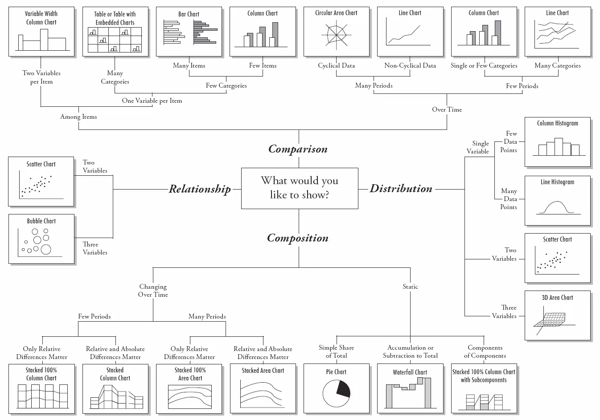

- [Chapter 1](#chapter-1)
  - [Glossary](#glossary)
  - [Roles in Data Analytics Team](#roles-in-data-analytics-team)
  - [Data Science Process](#data-science-process)
  - [Data Analytics Types](#data-analytics-types)
  - [Applications of Data Science](#applications-of-data-science)
- [Chapter 2 Data Collection, Sampling and Preprocessing](#chapter-2-data-collection-sampling-and-preprocessing)
  - [Glossary](#glossary-1)
  - [Data Characteristics](#data-characteristics)
  - [Types of Data Sources](#types-of-data-sources)
  - [Data Elements](#data-elements)
  - [Data Collection Methods](#data-collection-methods)
  - [Sampling](#sampling)
  - [Sampling Bias](#sampling-bias)
  - [Data Preprocessing](#data-preprocessing)
  - [Missing Values](#missing-values)
  - [Outliers](#outliers)
  - [Data Transformation](#data-transformation)
  - [Correlation Analysis](#correlation-analysis)
  - [Exploratory Statistical Analysis](#exploratory-statistical-analysis)
  - [Data Visualization](#data-visualization)
  - [Storage Requirements](#storage-requirements)
  - [Storage Medium](#storage-medium)
- [Chapter 3 Visualization and Descriptive Analytics](#chapter-3-visualization-and-descriptive-analytics)
  - [Glossary](#glossary-2)
  - [Types of Data Visualization](#types-of-data-visualization)
  - [Common Data Visualization Issues](#common-data-visualization-issues)
  - [Chart Types](#chart-types)
  - [Descriptive Analytics](#descriptive-analytics)
  - [Association Rules](#association-rules)
  - [Sequence Rules](#sequence-rules)
  - [Segmentation](#segmentation)
- [Chapter 4 Supervised Learning](#chapter-4-supervised-learning)
  - [Types of Supervised Learning](#types-of-supervised-learning)
  - [Linear Regression](#linear-regression)
  - [K-Nearest Neighbors (KNN)](#k-nearest-neighbors-knn)
  - [Decision Trees](#decision-trees)
  - [Naive Bayes](#naive-bayes)
  - [Artificial Neural Networks (ANN)](#artificial-neural-networks-ann)
  - [Support Vector Machines (SVM)](#support-vector-machines-svm)
  - [Model Evaluation and Selection](#model-evaluation-and-selection)
- [Chapter 5 Unsupervised Learning](#chapter-5-unsupervised-learning)
  - [Clustering](#clustering)
  - [Hierarchical Clustering](#hierarchical-clustering)
  - [Non-Hierarchical Clustering](#non-hierarchical-clustering)
- [Chapter 6 Data Quality](#chapter-6-data-quality)
  - [Problems with Data Quality](#problems-with-data-quality)
  - [Improving Data Quality](#improving-data-quality)
  - [Privacy and Ethical Issues](#privacy-and-ethical-issues)
  - [Data Anonymization Techniques](#data-anonymization-techniques)

# Chapter 1

### Glossary

- **Data Science (DS)**: An **interdisciplinary field** about **scientific methods, processes and systems** to extract **knowledge or insights** from data in various forms, either **structured or unstructured**.
- **Data Scientist**: A hybrid statistician, computer scientist, and social scientist.
  - Expert in computer science, statistics, communication, visualization, and have extensive domain knowledge.
  - Roles: Collect Data, Data Cleaning, Build Algorithms, Generate Insights, Build Training Data, ...

### Roles in Data Analytics Team

- **Database/Data Warehouse Administrator (DBA)**: Aware of the data available, storage details and data definition. Data provider.
- **Data Scientist/Data Miner/Data Analyst**: Performs analytical tasks, communicates and presents analytical findings.
- **Business Experts**: Domain experts who understand the business context and can interpret data findings.
- **Legal Experts**: Ensure data usage complies with legal and ethical standards depending on the geographic location and industry.
- **Software Tools Vendor**: Provides software tools to automate data processing and analysis tasks.
- **Chief Data Scientist**: Setting data strategy and goal, managing the data science team, communicating with stakeholders, patenting new algorithms

### Data Science Process

- **Data Understanding**: Identify the data sources, understand the data structure, and gather initial insights.
- **Data Selection**: Choose relevant data for analysis based on the problem statement.
- **Data Cleaning**: Handle missing values, outliers, and inconsistencies in the data.
- **Data Transformation**: Convert data into a suitable format for analysis, including normalization, encoding, and feature engineering.
- **Data Analytics**: Apply statistical and machine learning techniques to extract insights from the data.
- **Interpretation and Evaluation**: Interpret the results, validate findings, and evaluate the model's performance.

### Data Analytics Types

- **Descriptive Analytics**: Summarizes historical data to understand what has happened.
- **Diagnostic Analytics**: Analyzes data to understand why something happened.
- **Predictive Analytics**: Uses historical data to predict future outcomes.
- **Prescriptive Analytics**: Recommends actions based on data analysis to achieve desired outcomes.

### Applications of Data Science

- **Marketing**
  - **Response Modeling**: Predicting customer responses to marketing campaigns.
  - **Net Lift Modeling**: Estimating the incremental impact of marketing efforts.
  - **Retention Modeling**: Identifying customers likely to churn and strategies to retain them.
  - **Market Basket Analysis**: Analyzing customer purchasing patterns to optimize product placement and promotions.
  - **Recommender Systems**: Suggesting products or content to users based on their preferences and behaviors.
  - **Customer Segmentation**: Grouping customers based on similar characteristics for targeted marketing.
- **Risk Management**
  - **Credit Risk Modeling**: Assessing the likelihood of a borrower defaulting on a loan.
  - **Market Risk Modeling**: Evaluating potential losses in investment portfolios due to market fluctuations.
  - **Operational Risk Modeling**: Identifying and mitigating risks arising from internal processes, systems, or external events.
  - **Fraud Detection**: Using data analysis techniques to identify and prevent fraudulent activities.
- **Government**
  - **Tax Avoidance Detection**: Identifying individuals or entities attempting to evade tax obligations.
  - **Social Security Fraud Detection**: Detecting fraudulent claims and activities in social security systems.
  - **Money Laundering Detection**: Analyzing financial transactions to identify suspicious activities related to money laundering.
  - **Terrorism Financing Detection**: Identifying and preventing the financing of terrorism through data analysis.
- **Web**
  - **Web Analytics**: Analyzing user behavior on websites to improve user experience and optimize marketing efforts.
  - **Social Media Analytics**: Analyzing user interactions and content on social media platforms to derive insights and inform marketing strategies.
  - **Multivariate Testing**: Testing multiple variables simultaneously to determine their effect on a target outcome.
- **Logistics**
  - **Demand Forecasting**: Predicting future customer demand to optimize inventory levels and reduce stockouts.
  - **Supply Chain Analytics**: Analyzing and optimizing the supply chain process to improve efficiency and reduce costs.
- **Other**
  - **Text Analytics**: Extracting insights from unstructured text data using natural language processing techniques.
  - **Business Process Analytics**: Analyzing and optimizing business processes to improve efficiency and effectiveness.

# Chapter 2 Data Collection, Sampling and Preprocessing

### Glossary

- **Data**: Raw facts that can be processed to extract information.
- **Big Data**: Large volume of data, both structured and unstructured, from various sources.
  - Not amount of data that is important, but can extract insights from it.
- **Information**: Processed data that is meaningful and useful for decision-making.
- **Knowledge**: Insights derived from information that can guide actions and decisions.
- **Data Collection**: The activity of collecting information that can be used to find out about a particular subject.
- **Observation**: A single data point or record in a dataset, representing a specific instance of the phenomenon being studied.
- **Sampling**: The process of selecting a subset of data from a larger dataset to make inferences about the whole.
- **Sampling Bias**: A systematic error that occurs when the sample is not representative of the population, leading to skewed results.
- **Data munging/wrangling**: The process of mapping raw data from its original form into a format that is more appropriate for analysis.
- **Data Preprocessing**: The steps taken to clean and prepare data for analysis, including handling missing values, outliers, and transforming data into a suitable format.
- **Outliers**: Data points that differ significantly from other observations, potentially skewing analysis results.

### Data Characteristics

- **Garbage In, Garbage Out (GIGO)**
- **Key Ingredient**
- **Messy**
- **The more, the better**

### Types of Data Sources

- **Transactional Data**: Structured and low level
- **Public Data**: Macroeconomic, social media data
- **Qualitative, Expert Based Data**: Business experts' insights, surveys
- **Unstructured Data**: Text, images, audio, video

### Data Elements

- Continuous
- Categorical
  - Ordinal
  - Nominal
  - Binary

### Data Collection Methods

- Primary Data
  - **Direct Observation**
  - **Interviews**
  - **Experiments**
  - **Surveys/Questionnaires**
- Secondary Data
  - **Documents**
    - Govt publications
    - Earlier research
    - Client history

### Sampling

- Choosing an optimal time window for the sample, trade-off between lots of data and recent data.
- **Reason for Sampling**
  - **Not feasible** to collect and store all data.
  - **Inconvenient** to work with all data.
  - **More time efficient** to work with compact summary of data.
- **Characteristics of Good Sample**
  - **Intuitive Semantics**: Smaller dataset that is representative of the larger dataset.
  - **Straightforward**: The same analysis can be applied to the sample as to the full dataset.
  - **General and agnostic**: Better summary method than the other methods such as mean, median, etc, which can only work with certain computations.
  - **Easy to understand**: The sample should be easy to interpret and communicate.

### Sampling Bias

- **Stratified Sampling**
  - Dividing the population into subgroups (strata) and sampling from each stratum.
  - Eg. dividing a population by age groups and sampling from each age group.

### Data Preprocessing

- Steps of Data Wrangling

  - **Obtain**: Collect the data from various sources.
  - **Understand**: Explore the data to understand its structure, quality, and content.
  - **Transform**: Clean and transform the data into a suitable format for analysis.
  - **Augment**: Enhance the data by adding new features or combining existing ones.
  - **Shape**: Restructure the data to fit the analysis requirements.

    > Acronym: **OUTAS**

### Missing Values

- Factors contributing to missing values:
  - Human Error
  - Undisclosed Information (Private information)
  - Nonapplicable information (Not relevant to the individual)
  - Outlier values (Extreme values that are not representative)
- **Handling Missing Values**
  - **Imputation**: Replace missing values with known values, such as mean, median, or mode.
    - Use mean for normally distributed continuous variables.
    - Use mode for categorical variables.
    - Use median for skewed distributions.
  - **Deletion**: Remove rows or columns with missing values.
    - Delete the row when the missing value is not significant or when the row has too many missing values.
    - Delete the column when the column has too many missing values or when it is not relevant to the analysis.
  - **Keep**: Keep missing values as a separate category if they carry meaning.
    - Keep when missing values are informative (e.g., "Not Applicable" or "Unknown").
- How to choose the method:
  - **Statistical tests** to determine if the missing values are random or related to other variables.
  - **Observe** the number of available observations

### Outliers

- **Multivariate Outliers**: Outliers that exist in a multi-dimensional space, where the relationship between multiple variables is considered.
- **Handling Outliers**
  - **Detection**:
    - Histograms
    - Box plots
    - IQR (Interquartile Range)
      - 1.5 \* IQR rule: Values outside 1.5 times the IQR from the first and third quartiles are considered outliers.
    - Z-scores
      - |z| > 3: Values with z-scores greater than 3 or less than -3 are considered outliers.
    - Regression Residuals
      - For multivariate outliers
      - Analyzing the residuals of a regression model to identify outliers.
    - Clustering & Mahalanobis Distance
      - For multivariate outliers
      - Using clustering techniques or Mahalanobis distance to identify outliers in multi-dimensional data.
      - **Mahalanobis Distance**: A measure of the distance between a point and a distribution, taking into account the correlations of the data set.
  - **Treatment**:
    - **Analytical Techniques**
      - Decision Trees, Neural Networks, SVM are robust to outliers.
    - **Capping**: Limit the values of outliers to a certain range.
      - Sigmoid Capping: Use a sigmoid function to cap the values of outliers.
      - Min-Max Capping: Set a minimum and maximum value for the outliers.
        - M ± 3s, M is the median, s = IQR/(2 x 0.6745)
        - s is the standard deviation of the data, 0.6745 is the alpha value for 25th/75th percentile in a normal distribution.

### Data Transformation

- **Normalization**: Scaling the data to a specific range.
  - **Min-Max Normalization**: Rescaling the data to a range of [0, 1].
  - **Z-score Normalization**: Scaling the data based on the mean and standard deviation.
  - **Decimal Scaling**: Shifting the decimal point of the data to reduce its range.
- **Binning**: Reducing the number of distinct values by grouping them into bins.
  - **Equal Width/Interval Binning**: Dividing the range of values into equal intervals, each bin has the same width (difference between the maximum and minimum values)
  - **Equal Frequency Binning**: Dividing the data into bins with an equal number of observations.

### Correlation Analysis

- Identifying relationships between variables.
- **Chi-Squared Test**: A statistical test to determine if there is a significant association between two categorical variables.
  - Sum of (Observed - Expected)^2 / Expected
- **Pearson Correlation Coefficient**: Measures the linear relationship between two continuous variables.

### Exploratory Statistical Analysis

- Use statistical methods to summarize and explore the data.
  - Eg. mean, standard deviation, min/max, percentiles, confidence intervals, etc.
- Visualize data in pictorial/graphical form to gain insights (grasp concepts and identify new patterns).

### Data Visualization

| Chart Type   | Description                                                    | Strengths                                                                                                                               | Weaknesses                                                                                         |
| ------------ | -------------------------------------------------------------- | --------------------------------------------------------------------------------------------------------------------------------------- | -------------------------------------------------------------------------------------------------- |
| Pie Chart    | Displays proportions of a whole                                | Easy to understand, good for showing parts of a whole                                                                                   | Not effective for comparing multiple categories, can be misleading with too many slices            |
| Histogram    | Shows distribution of a single variable                        | Visualise central tendency, determine spread of the data, contrast with normal distribution (check if it is skewed), outliers detection | Not suitable for comparing multiple variables, can hide details in large datasets (data is binned) |
| Scatter Plot | Displays relationship between two variables                    | Good for identifying correlations, outliers, and trends                                                                                 | Can be cluttered with large datasets, not effective for categorical data                           |
| OLAP         | Online Analytical Processing, allows for complex data analysis | Good for multidimensional data analysis, interactive exploration (dicing, slicing, drilling, pivoting, etc.)                            | Requires specialized tools, can be complex to set up and maintain                                  |

### Storage Requirements

- Capacity
- Speed
- Volume
- Cost
- Throughput
- Scalability
- Reliability
- Access Time and Data Transfer Rate

### Storage Medium

- Challenges in traditional storage
  - **Hard Disk Drive (HDD)**: Magnetic storage, cheap price, but high disk-access overhead, overheating, magnetic faults, mechanical failures.
  - **Solid State Drive (SSD)**: Flash storage, more reliable, but price per GB is higher than HDD.
  - **Optical Storage**: CD/DVD/Blu-ray, used for archiving data, but slow access time and limited write cycles.
- **Modern Storage Solutions**
  - **StaaS (Storage as a Service)**: Cloud-based storage solutions, scalable, accessible from anywhere, pay-as-you-go pricing.
  - **Object-based Storage**: Stores data as objects, suitable for unstructured data due to variable-length nature.
  - **NAS (Network Attached Storage)**: Dedicated file storage that provides data access to multiple users over a network.
  - **IP-SAN (Internet Protocol Storage Area Network)**: High-speed network that provides block-level storage access over IP networks.

# Chapter 3 Visualization and Descriptive Analytics

### Glossary

### Types of Data Visualization

- **Exploration**: Exploring data to identify patterns, trends, and anomalies.
- **Explanation**: Communicating the insights derived from the data.

### Common Data Visualization Issues

- **Inappropriate Display Choices**: Using the wrong type of chart or graph for the data being presented. For example, using a 3D chart to represent data that could be easily understood in 2D.
- **Variety for the Sake of Variety**: Using multiple visualization types without a clear purpose, leading to confusion.
- **Too Much Information**: Overloading the visualization with too much data, making it difficult to interpret.
- **Poorly Designed Visualizations**: Visualizations that are not well thought out, leading to misinterpretation or confusion. For example, using line chart for categorical data or pie charts with too many slices.
- **Encoding Quantitative Data Inaccurately**: Using inappropriate scales or axes for quantitative data, leading to misleading representations.
- **Inconsistent Ordering**: Not maintaining a consistent order in categorical data, making it hard to compare.
- **Inconsistent or Reversed Scales**: Not maintaining a consistent scale or reversing the scale, leading to confusion.
- **Proportional axis scaling**: Not scaling axes proportionally, leading to distorted representations of data.

### Chart Types

### Descriptive Analytics

- An analytics process which **analyzes and summarizes historical or current data** to **gain insights and understand patterns**.
- Statistical measures to summarize and describe the main features of a dataset.
  - **Measures of Central Tendency**: Mean, Median, Mode
  - **Measures of Dispersion**: Range, Variance, Standard Deviation
  - **Measures of Relative Position**: Standard Score (Z-score), Percentile Rank, Percentile Score
  - **Measures of Relationship**: Correlation Coefficient

### Association Rules

- Identifying relationships between variables in a dataset, examine whichitems frequently co-occur.
- Applications
  - Market Basket Analysis
  - Web Usage Mining
  - Customer Behavior Analysis
  - Healthcare Diagnosis
  - Social Network Analysis
- Methodology
  - If customer buys item A, they are likely to buy item B.
  - Annotate with $X \rightarrow Y$
  - Support: Proportion of transactions that contain both A and B.
    - $\text{support}(A, B) = \frac{\text{freq}(A,B)}{N}$
  - Confidence: Proportion of transactions with A that also contain B.
    - $\text{confidence}(A, B) = \frac{\text{support}(A,B)}{\text{support}(A)}$
  - Lift: Ratio of observed support to that expected if A and B were independent.
    - $\text{lift}(A \rightarrow B) = \frac{\text{support}(A, B)}{\text{support}(A) \times \text{support}(B)}$
    - Lift > 1: Positive dependency, complementary effect
    - Lift < 1: Negative dependency, substitution effect
    - Lift = 1: No dependency
- Apriori Algorithm
  1. Define minimum support and confidence thresholds.
  2. Iteratively generate frequent itemsets by:
     - Generating candidate itemsets of length k from frequent itemsets of length k-1.
     - Pruning candidates that do not meet the minimum support threshold.
     - Repeating until no new frequent itemsets are found.
  3. Generate association rules from the frequent itemsets that meet the minimum confidence threshold.
  4. Post-process the rules to remove redundant or uninteresting rules.
     - Remove already known patterns (such as buying bread and butter together)
     - Varying the support and confidence thresholds to find more interesting rules for rare but profitable items.

### Sequence Rules

- Sequence aware association rules, consider the order of events.
- Applications
  - Detect sequence of events
  - Detect sequence of words
- Similar method to association rules, but consider the order of events.

### Segmentation

- Dividing a dataset into distinct groups based on similarities in characteristics or behaviors.
- Applications
  - Business: Customer Segmentation, Market Segmentation
  - Healthcare: Patient Segmentation for personalized treatment
  - Identify fraudulent activities
- Techniques
  - Non-hierarchical: K-means Clustering, Self-Organizing Maps (SOM)
  - Hierarchical: Agglomerative Clustering, Divisive Clustering

# Chapter 4 Supervised Learning

- A type of machine learning where the model is trained on labeled data, meaning that each input has a corresponding output or target value.

### Types of Supervised Learning

- **Classification**: Predicting a categorical label for an input based on its features.
  - Eg. Spam detection, fraud detection, image recognition
- **Regression**: Predicting a continuous value for an input based on its features.
  - Eg. House price prediction, stock price prediction, weather forecasting

### Linear Regression

- Express linear relationship between dependent variable (Y) and independent variables (X).
- Equation: $Y = \beta_0 + \beta_1X_1 + \beta_2X_2 + ... + \beta_nX_n + \epsilon$
  - $\beta_0$: Intercept
  - $\beta_i$: Coefficients for each independent variable
  - $\epsilon$: Error term
- To increase confidence in the model:
  - Increase more predictor variables
  - Transform predictor variables
  - Increase sample size
  - Add in model assumpption about error term
- Logistic Regression (Extra)
  - Used for classification problems
  - Multiple classes: One-vs-Rest, One-vs-One
  - Output is probability between 0 and 1
  - Equation: $P(Y=1|X) = \frac{1}{1 + e^{-(\beta_0 + \beta_1X_1 + ... + \beta_nX_n)}}$
  - Decision Boundary: Threshold to classify the output (commonly 0.5)

### K-Nearest Neighbors (KNN)

- Non-parametric, instance-based learning algorithm.
- Used for both classification and regression tasks.
- Need to define
  - Distance Metric: Euclidean, Manhattan, Cosine Similarity
  - Number of Neighbors (K)
  - Voting Mechanism: Majority voting for classification, average for regression
- Can use misclassification rate to choose optimal K value.

### Decision Trees

- Recursive Partitioning Algorithm (RPA) to split data into subsets based on feature values.
- Every node represents a feature, every branch represents a decision rule, and every leaf node represents an outcome.
- Need to define
  - Splitting Decision: Which variable to split on and what value to split at, based on criteria like Gini impurity, Information Gain, Chi-Squared.
  - Stopping Criteria: Minimum samples per leaf, maximum depth of the tree, minimum impurity decrease.
  - Assignment of Class Labels: Majority class in the leaf node for classification, mean value for regression.
- Information Gain
  - Weighted entropy of child nodes subtracted from the entropy of the parent node.
  - Entropy: $-\sum p(x) \log_2 p(x)$
  - Information Gain: $IG(T, X) = Entropy(T) - \sum \frac{|T_v|}{|T|} Entropy(T_v)$

### Naive Bayes

- Probabilistic classifier based on Bayes' theorem with strong independence assumptions between features.
- $P(Y|X) = \frac{P(X|Y)P(Y)}{P(X)}$

### Artificial Neural Networks (ANN)

- Inspired by biological neural networks, consists of layers of interconnected nodes (neurons).
- Structure
  - Input Layer: Receives input features.
  - Hidden Layers: Perform computations and extract features.
  - Output Layer: Produces the final output.
  - Neurons: Basic units that process information.
  - Synapses: Connections between neurons with associated weights.
- Training
  - Forward Propagation: Input data is passed through the network to generate predictions.
    - For every neuron, the output is calculated as $\text{output} = f(\sum (\text{input}_i \times \text{weight}_i) + \text{bias})$, where $f$ is the activation function.
  - Backpropagation: Errors are propagated back through the network to update weights using gradient descent.
    - Calculate the gradient of the loss function with respect to each weight.
    - Update weights: $\text{weight} = \text{weight} - \text{learning\_rate} \times \text{gradient}$
- Activation Functions
  - Sigmoid: $f(x) = \frac{1}{1 + e^{-x}}$, outputs values between 0 and 1.
  - ReLU (Rectified Linear Unit): $f(x) = \max(0, x)$, outputs values between 0 and infinity.
  - Tanh: $f(x) = \frac{e^x - e^{-x}}{e^x + e^{-x}}$, outputs values between -1 and 1.

### Support Vector Machines (SVM)

- Supervised learning algorithm used for classification and regression tasks.
- Finds the optimal hyperplane that maximally separates different classes in the feature space.
- Robust to high-dimensional data, outliers, non-linear decision boundaries.
- SVM can add kernel functions to transform data into higher dimensions for better separation.

### Model Evaluation and Selection

- Accuracy: Proportion of correct predictions.
- Training Time: Time taken to train the model, highly correlated with accuracy, but scale with data size.
- Linearity: Some models assume linear relationships, while others can handle non-linear relationships.
- No of Parameters: More parameters can lead to overfitting, while fewer parameters may underfit the data.
- No of Features: High-dimensional data can lead to the curse of dimensionality and increased computational complexity.

| Algorithm         | Pros                                                                       | Cons                                                                          | Use Case                                  |
| ----------------- | -------------------------------------------------------------------------- | ----------------------------------------------------------------------------- | ----------------------------------------- |
| Linear Regression | Simple, interpretable, efficient                                           | Assumes linearity, sensitive to outliers                                      | Baseline model for regression tasks       |
| Decision Trees    | Robust to noise, accurate                                                  | Possible duplicate splits, complex tree hard to interpret                     | Classification and regression tasks       |
| ANN               | No need to understand the underlying data, can model complex relationships | Prone to overfitting, uninterpretable, long training time                     | Image recognition, NLP, Voice recognition |
| SVM               | Complex and non-linear decision boundaries, robust to noise                | Need to select good kernel, hard to interpret, need significant memory        | Text classification, image classification |
| KNN               | Lazy learning, simple yet powerful                                         | Expensive at prediction time, performance degrades with high-dimensional data | Small datasets, low-dimensional data      |

# Chapter 5 Unsupervised Learning

- Unlabeled data, no target variable. Explore data to find hidden patterns or structures.
- Association Rules
- Sequence Rules
- Clustering

### Clustering

- Detect homogeneous groups in data based on similarity.
- Maximize heterogeneity between clusters
- Maximize homogeneity within clusters
- Applications
  - Customer Segmentation
  - Anomaly Detection
  - Image Segmentation
  - Document Clustering

### Hierarchical Clustering

- Create a hierarchy of clusters using either agglomerative (bottom-up) or divisive (top-down) approach.
- Distance Metrics
  - Euclidean Distance
  - Manhattan Distance
  - Cosine Similarity
- Distance calculation between clusters
  - Single Linkage: Minimum distance between points in two clusters.
  - Complete Linkage: Maximum distance between points in two clusters.
  - Average Linkage: Average distance between points in two clusters.
  - Centroid Linkage: Distance between centroids of two clusters.
- Dendrogram: Tree-like diagram to visualize the hierarchy of clusters.
  - Cut the dendrogram at a certain height to form clusters.
- Scree Plot: Plot of distance at which clusters are merged, look for the "elbow" point to determine optimal number of clusters.

### Non-Hierarchical Clustering

- **K-means Clustering**
  - Partition data into K clusters based on similarity.
  - Steps:
    1. Initialize K centroids randomly.
    2. Assign each data point to the nearest centroid.
    3. Update centroids by calculating the mean of assigned points.
    4. Repeat steps 2 and 3 until convergence (no change in assignments or centroids).
  - Choosing K:
    - Elbow Method: Plot the sum of squared distances (inertia) for different K values and look for the "elbow" point.
    - Silhouette Score: Measure of how similar a point is to its own cluster compared to other clusters, ranges from -1 to 1.
- **Competitive Learning**
  - Winner-takes-all rule
  - Unlike classifier NN, only the winning neuron gets updated.
  - Winning neuron is the one with its weights closest to the input vector.
  - The weights of the winning neuron are adjusted to be closer to the input vector.
- **Self-Organizing Maps (SOM)**
  - Add onto competitive learning, the winning neuron also updates its neighbors.
  - Neurons are arranged on a grid, and neighboring neurons are updated with neighborhood function such as Gaussian function.
  - Reduce learning rate and neighborhood size over time to fine-tune the map.
  - Reserve topology of the input space, meaning that similar input vectors are mapped to nearby neurons on the grid.
  - Suitable for visualisation and dimensionality reduction.

# Chapter 6 Data Quality

- Intrinsic (Quality inherent to the data itself)
  - Accuracy: Correctness of data values.
    - Can be dependent on the context, such as date format (DD/MM/YYYY vs MM/DD/YYYY) in different regions.
  - Believability: Trustworthiness of data source. (Credibility)
  - Objectivity: Unbiased and impartial data.
  - Reputation: Data source's standing in the community.
- Contextual (The context in which the data is used)
  - Value-Added: Beneficial for their intended use.
  - Completeness: Data values are present.
    - Schema Completeness: All required fields and entities are present.
    - Column Completeness: No missing values in a column.
    - Population Completeness: Row completeness, all attributes of a row are present. (Special case: if a missing value is not applicable, it is not considered incomplete)
  - Relevancy: Applicable to the task at hand.
  - Appropriate Amount of Data: Sufficient data for analysis.
  - Consistency: Uniformity of data across different sources.
    - Redundancy: No duplicate records.
    - Related attributes: Derived attributes are consistent with their base attributes. (Eg. Age and Date of Birth)
    - Data format: Consistent data formats across the dataset. (Eg. Date format, Phone number format)
- Representational (How data is formatted)
  - Interpretability: In appropriate language and unit, clear definitions.
  - Ease of Understanding: Clear and without ambiguity.
- Accessibility (How easily data can be accessed)
  - Accessibility: Available and obtainable.
    - Consider the time taken to access the data, to avoid delays in important decisions.
  - Security: Restricted access to keep data safe.

### Problems with Data Quality

- Multiple Sources: Lack consistency due to different formats and standards
- Subjective Judgment: Lack objectivity and believability
- Limited computing facilities: Lack accessibility
- Size of data: Lack accessibility due to slow retrieval times

### Improving Data Quality

- **Define** important data quality dimensions
- **Assess** current data quality levels
- **Analyze** root causes of data quality issues
- **Improve** data quality through targeted interventions
- Repeat the process to ensure continuous improvement

### Privacy and Ethical Issues

- Data can be collected without consent, or not aware of how it is used.
- For example, credit risk modeling may uses information across multiple domains, such as financial history, social media activity, and personal demographics, for a more comprehensive assessment of an individual's creditworthiness. However, this raises concerns about privacy and data security, as individuals may not be aware of the extent of data being collected and how it is being used.
- Quasi-identifiers: Attributes that can be combined to uniquely identify an individual, such as date of birth
  - Can be used to re-identify anonymized data.

### Data Anonymization Techniques

- **Generalization**: Replace specific values with more general ones to reduce identifiability.
  - Eg. Replace exact age with age range, replace specific location with broader region.
- **Suppression**: Replace certain values with a placeholder (e.g., "\*") to hide sensitive information.
  - Eg. Replace social security numbers with "\*", replace names with "\*".
- **Anatomization and Permutation**: Separate quasi-identifiers from sensitive attributes, and shuffle the sensitive attributes.
  - Eg. Separate names and social security numbers from medical records, and shuffle the medical records.
